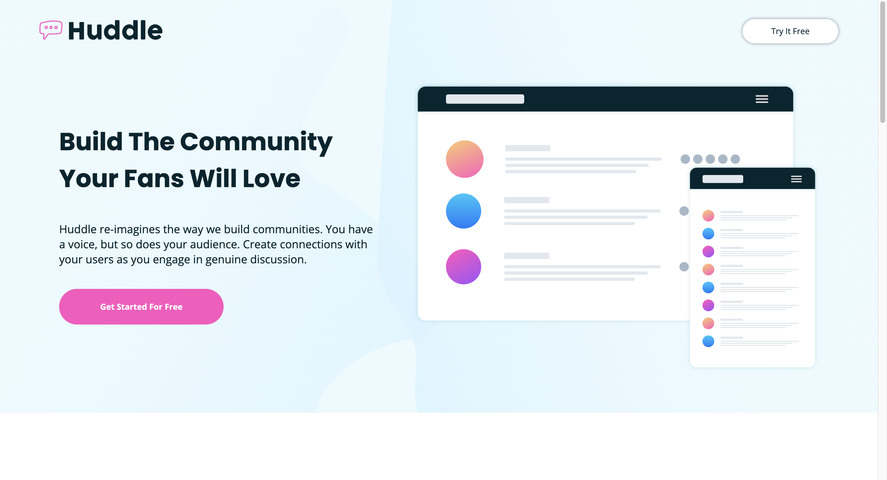
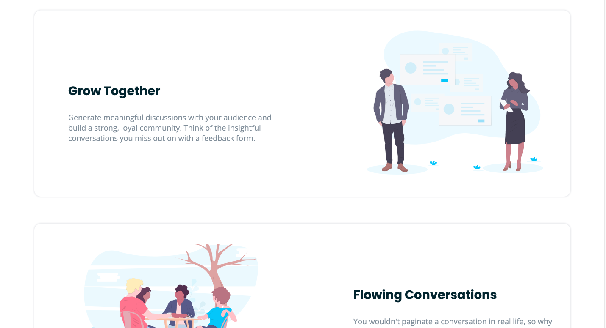
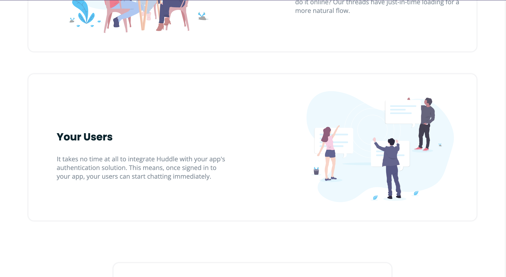
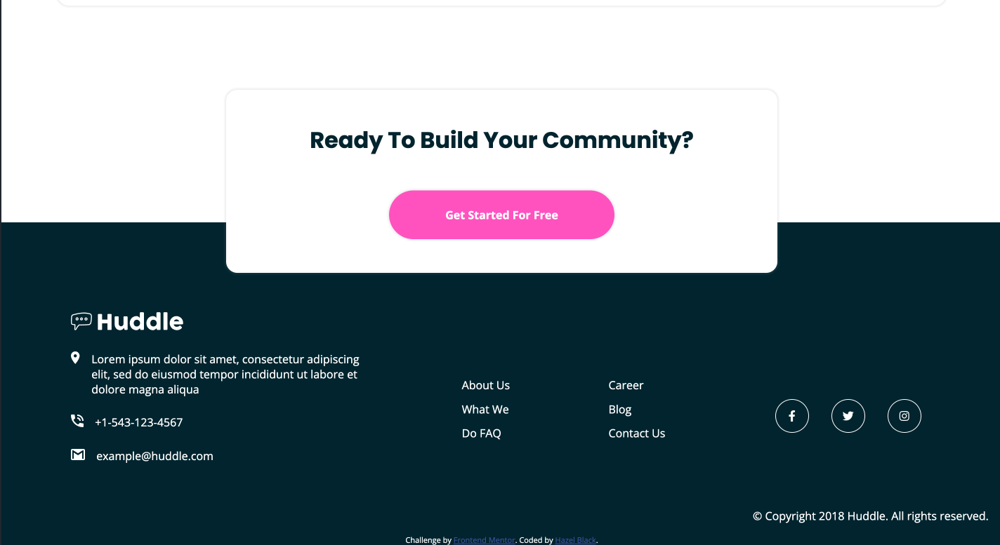

# Frontend Mentor - Huddle landing page with alternating feature blocks solution

This is a solution to the [Huddle landing page with alternating feature blocks challenge on Frontend Mentor](https://www.frontendmentor.io/challenges/huddle-landing-page-with-alternating-feature-blocks-5ca5f5981e82137ec91a5100). Frontend Mentor challenges help you improve your coding skills by building realistic projects.

## Table of contents

- [Overview](#overview)
  - [The challenge](#the-challenge)
  - [Screenshot](#screenshot)
  - [Links](#links)
- [My process](#my-process)
  - [Built with](#built-with)
  - [What I learned](#what-i-learned)
  - [Continued development](#continued-development)
- [Author](#author)

## Overview

This was a very fun project to work on. This project allowed me to spend more time practicing my layout skills with flexbox. This is a simple project but certain small details made it a little more difficult. Overall I really enjoyed the experience and I look forward to doing more FM junior projects.

### The challenge

Users should be able to:

- View the optimal layout for the site depending on their device's screen size
- See hover states for all interactive elements on the page

### Screenshot






### Links

- Solution URL: [solution: ](https://www.frontendmentor.io/solutions/landing-page-html5-css-mobile-first-custom-css-properties-h7S9xbJ11P)
- Live Site URL: [live site: ](https://hazel-black.github.io/huddle-landing-page-with-alternating-feature-blocks-master/)

## My process

### Built with

- Semantic HTML5 markup
- CSS custom properties
- Flexbox
- Mobile-first workflow

### What I learned
Durring this project I learned that its okay to use position absolute/relative when its nessecary. The important thing is understanding which times it is needed. Here is a snapshot of me using position relative on the floating bottom card in this project.  

```css
.bottom-card{
  box-shadow: 0em 0em .2em .1em hsla(209, 11%, 55%, 0.19);
  background-color: white;
  margin-top: 3em;
  padding-block: 3em;
  border-radius: 1em;
  position: relative;
  bottom: -4.5em;
  text-align: center;
  padding-inline: .5em;
}
```

### Continued development
At The moment I plan to start collaborating with others on frontend mentor projects  and learning javascript. I look forward to learning and growint with my peers and gaining knowledge in Javscript.  


## Author

- Frontend Mentor - [@Hazel-Black](https://www.frontendmentor.io/profile/Hazel-Black)
